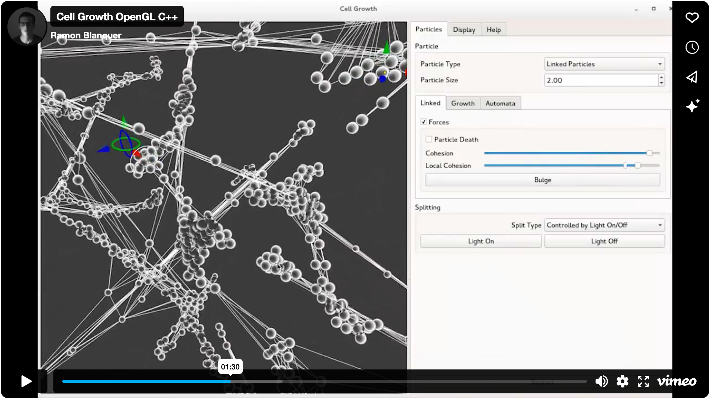

# Cell Growth

Programming project that explores visualization of different growth-like
particle system based algorithms.

[](https://vimeo.com/220070559?p=0s)

The components of our group and brief description of their area of work:

| Member           | Task                                 |
| ---------------- | ------------------------------------ |
| Lola Gille       | Particle links and splitting design  |
| Glenn Nygard     | Light and interactive manipulators   |
| Lydia Kenton     | Cell dynamics and force calculations |
| Esme Prior       | Cell dynamics and force calculations |
| Valeria Marstorm | Visualization, rendering and shading |
| Ramon Blanquer   | Director                             |

## Instructions

There is a [User Manual](CellGrowthUserManual.pdf) in PDF format.

```
cd CellGrowthProjectCVA3
qmake Cells.pro
make
./cells
```

## Documentation

Check the [Deployed Documentation](https://eulersson.github.com/CellGrowth) or
build it:

```
doxygen Doxyfile
google-chrome docs/html/index.html
```
